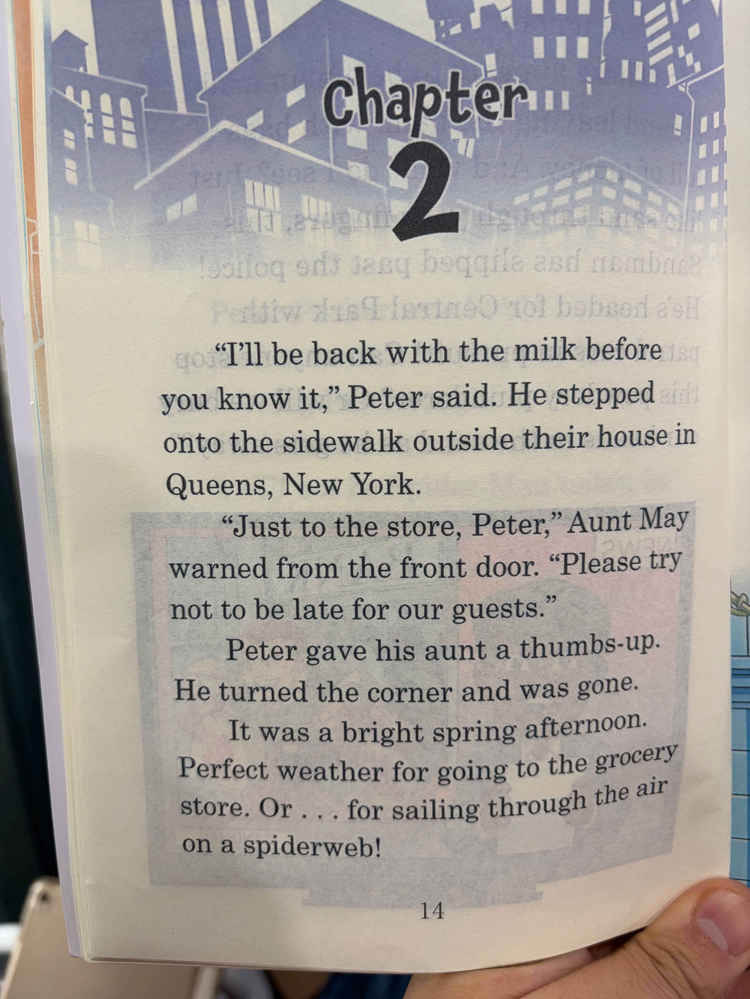

# Chapter 02
> 包含页面：12, 13, 14, 15

## Page 12 (IMG_8643)

<table>
<tr>
<td width="52%" valign="top">

</td>
<td width="48%" valign="top">

## 英文原文朗读
Chapter 2

"I'll be back with the milk before you know it," Peter said. He stepped onto the sidewalk outside their house in Queens, New York.

"Just to the store, Peter," Aunt May warned from the front door. "Please try not to be late for our guests."

Peter gave his aunt a thumbs-up. He turned the corner and was gone.

It was a bright spring afternoon. Perfect weather for going to the grocery store. Or . . . for sailing through the air on a spiderweb!

## 中文演绎
第 2 章

"我马上就会把牛奶带回来，快得你都反应不过来。"彼得说着，走上了纽约皇后区家门外的人行道。

"只许去商店，彼得，"梅姨在前门口提醒道，"尽量别让客人久等。"

彼得冲姨妈竖起大拇指，拐过街角就不见了。

那是个明亮的春日下午，天气好得很，正适合去杂货店。当然……也很适合踩着蛛丝在空中飞荡！

</td>
</tr>
</table>

## Page 13 (IMG_8644)

<table>
<tr>
<td width="52%" valign="top">

</td>
<td width="48%" valign="top">

## 英文原文朗读
"Woo-hoo!" Spider-Man yelled as he swung between skyscrapers. "The Sandman was last seen headed toward Central Park. I bet I can make it there in a New York minute!"

Spider-Man raced into Manhattan. He knew he must catch the Sandman quickly if he wanted to make his tea time.

There was no question that Peter wanted to help Aunt May. He wanted to get the milk, he could swing by the grocery store on his way home. He even wanted to go to the tea party, everyone

## 中文演绎
"呜呼！"蜘蛛侠在摩天大楼间荡行时大喊，"沙人最后一次出现，是朝着中央公园去了。我打赌我能在纽约人说的一分钟里赶到那儿！"

蜘蛛侠飞快冲进曼哈顿。他知道，如果还想赶上喝茶时间，就必须尽快抓住沙人。

彼得当然想帮梅姨。他想把牛奶买回来，回家路上顺便去一趟杂货店就行。他甚至也想去参加茶会，毕竟大家都

</td>
</tr>
</table>

## Page 14 (IMG_8645)

<table>
<tr>
<td width="52%" valign="top">

</td>
<td width="48%" valign="top">

## 英文原文朗读
likes a nice cup of Earl Grey, right? But after he was bitten by a radioactive spider and woke up with super powers, Peter had learned that sometimes the tea parties had to wait.

So it was for the webbed warrior. Spider-Man's super heroics were always in demand. Still, having a secret Super Hero identity was not always easy. He could hardly tell his teachers that the Green Goblin ate his homework.

But whenever Peter wondered if

## 中文演绎
（承接上一页）
都会喜欢来上一杯伯爵茶，对吧？但在被放射性蜘蛛咬过、醒来后拥有超能力之后，彼得已经明白了，有时候茶会也得先等等。

对这位吐丝战士来说，一向如此。蜘蛛侠的英雄行动总是随时都有人需要。尽管如此，拥有一个秘密的超级英雄身份并不总是件轻松事。他总不能跟老师说，是绿魔把他的作业给吃了。

不过每当彼得开始怀疑，自己是否

</td>
</tr>
</table>

## Page 15 (IMG_8646)

<table>
<tr>
<td width="52%" valign="top">

</td>
<td width="48%" valign="top">

## 英文原文朗读
he should hang up his webs and leave crime fighting to the Avengers, the words of his late Uncle Ben helped him make the right choice. "With great power comes great responsibility," Uncle Ben had told him.

No matter what was happening in Peter Parker's world, Spider-Man would always answer a call for help!

## 中文演绎
（承接上一页）
自己是不是该收起蛛丝，把打击犯罪的事交给复仇者们时，已故本叔叔的话总会帮助他作出正确选择。"能力越大，责任越大，"本叔叔曾这样告诉他。

无论彼得·帕克的生活里正发生什么事，蜘蛛侠总会回应求助的呼声！

</td>
</tr>
</table>

[⬅ 返回章节目录](../README.md)
