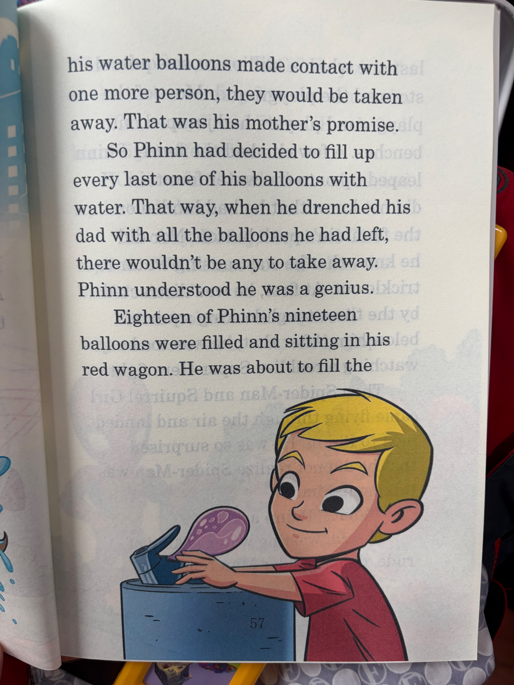

# Chapter 09
> 包含页面：47, 48, 49, 50, 51

## Page 47 (IMG_8680)

<table>
<tr>
<td width="52%" valign="top">

</td>
<td width="48%" valign="top">

## 英文原文朗读
Chapter 9

Phinneas Daniels had already had two warnings today. The first was after he dropped a water balloon on his mother's shoes (an accident). The second was after he dropped one on his little sister's head (not an accident). If

## 中文演绎
第 9 章

菲尼亚斯·丹尼尔斯今天已经收到过两次警告了。第一次是他把一个水球砸到妈妈鞋上之后（那是意外）。第二次是他把一个水球砸到妹妹头上之后（那可不是意外）。如果

</td>
</tr>
</table>

## Page 48 (IMG_8681)

<table>
<tr>
<td width="52%" valign="top">

</td>
<td width="48%" valign="top">

## 英文原文朗读
his water balloons made contact with one more person, they would be taken away. That was his mother's promise.

So Phinn had decided to fill up every last one of his balloons with water. That way, when he drenched his dad with all the balloons he had left, there wouldn't be any to take away. Phinn understood he was a genius.

Eighteen of Phinn's nineteen balloons were filled and sitting in his red wagon. He was about to fill the

## 中文演绎
（承接上一页）
他的水球再砸中哪怕一个人，这些水球就会被全部没收。这是他妈妈下的最后通牒。

所以，芬恩决定把自己剩下的每一个水球都先灌满水。这样等他拿这些水球把爸爸浇个透湿之后，就不会剩下任何一个给妈妈没收了。芬恩觉得自己简直是个天才。

他十九个水球里已经有十八个灌好，放在那辆红色小拖车里。正准备灌最后

</td>
</tr>
</table>

## Page 49 (IMG_8682)

<table>
<tr>
<td width="52%" valign="top">

</td>
<td width="48%" valign="top">

## 英文原文朗读
last one when a million or so squirrels stormed the playground. Most of the playground players had jumped onto benches. A few climbed the fence. Phinn leaped up onto the water fountain. He did not know that he had landed on the fountain's push button. Nor did he know that he was causing water to trickle out. At first, he was distracted by the three tough-looking squirrels below him. After that, he was too busy watching a real live Super Hero fight.

Then Spider-Man and Squirrel Girl came flying through the air and landed next to Phinn. He was so surprised that he did not realize Spider-Man was talking to him.

"What?" Phinn asked.
"I said, wasting water is kind of rude, dude," Spider-Man repeated.

## 中文演绎
（承接上一页）
一个时，大概有一百万只左右的松鼠突然冲进了游乐场。大多数在游乐场玩的人都跳上了长椅，有些还爬上了围栏。芬恩一下跳到饮水喷泉上。他不知道自己正好踩在喷泉的按钮上，也不知道自己正在让水慢慢流出来。起初，他被下面三只看起来很凶的松鼠吸引了注意。紧接着，他又忙着围观一场货真价实的超级英雄大战。

然后蜘蛛侠和松鼠妹从空中飞来，落在芬恩身边。他惊讶得都没意识到蜘蛛侠正在跟他说话。

"什么？"芬恩问。
"我说，浪费水有点没礼貌啊，小伙子，"蜘蛛侠又说了一遍。

</td>
</tr>
</table>

## Page 50 (IMG_8683)

<table>
<tr>
<td width="52%" valign="top">

</td>
<td width="48%" valign="top">

## 英文原文朗读
"Slow the flow, save H2O." He pointed at the water coming from the fountain.

"Oh, sorry," said Phinn. He shifted his weight off the button.

"Chitta chit!" barked one of the red squirrels below.

"It's okay, Buddy," Squirrel Girl replied. "We'll rinse you off when the battle's done."

Phinn looked at the squirrel, who was covered in wet, sandy glop.

## 中文演绎
"把水流关小点，节约 H2O。"他指着喷泉里流出来的水。

"哦，对不起，"芬恩说着，把重量从按钮上挪开了。

"Chitta chit！"下面一只红松鼠叫了起来。

"没事，巴迪，"松鼠妹回答，"等打完这一仗，我们会把你冲洗干净的。"

芬恩看着那只松鼠，它全身都裹着湿漉漉、黏糊糊的沙浆。

</td>
</tr>
</table>

## Page 51 (IMG_8684)

<table>
<tr>
<td width="52%" valign="top">

</td>
<td width="48%" valign="top">

## 英文原文朗读
"Hey, Spidey. Wasting water also gets Buddy muddy," Phinn said. He hoped the Super Hero would appreciate his rhyme. Maybe give him a thumbs-up. What he got was way better.

"That's it!" Squirrel Girl said. "The water! Kid, you're a genius!"

Phinn beamed. He didn't know what Squirrel Girl was talking about, but it was nice that someone appreciated his smarts.

"Can we borrow your balloons?" Spider-Man asked. Phinn nodded. The Super Heroes took the red wagon into battle. Phinn picked up Buddy the squirrel and rinsed him off. Then he filled up balloon nineteen, just in case.

## 中文演绎
"嘿，小蜘蛛。浪费水还会把巴迪弄得更脏呢，"芬恩说。他希望这位超级英雄会欣赏自己的押韵，说不定还会给他竖个大拇指。结果他得到的反应可好多了。

"就是这个！"松鼠妹叫道，"水！小子，你真是个天才！"

芬恩笑得合不拢嘴。他并不知道松鼠妹到底在说什么，但能有人欣赏自己的聪明劲，感觉真不错。

"我们能借用一下你的水球吗？"蜘蛛侠问。芬恩点了点头。两位超级英雄推着那辆红色小拖车重新投入战斗。芬恩抱起松鼠巴迪，把它冲洗干净。然后他又把第十九个水球也灌满了，以防万一。

</td>
</tr>
</table>

[⬅ 返回章节目录](../README.md)
