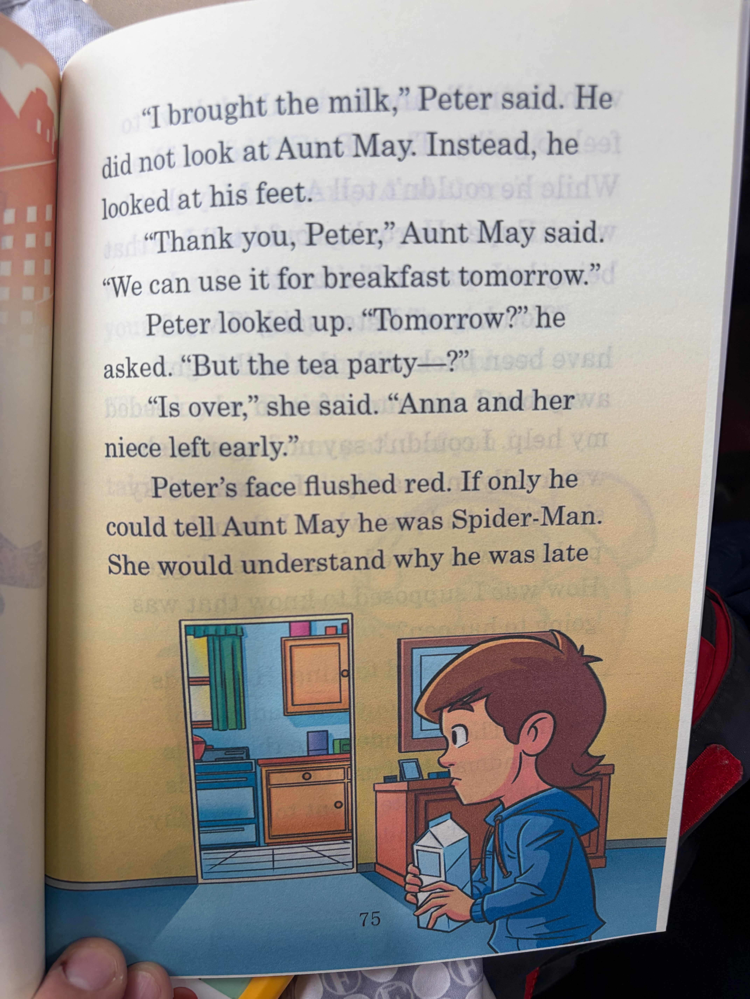
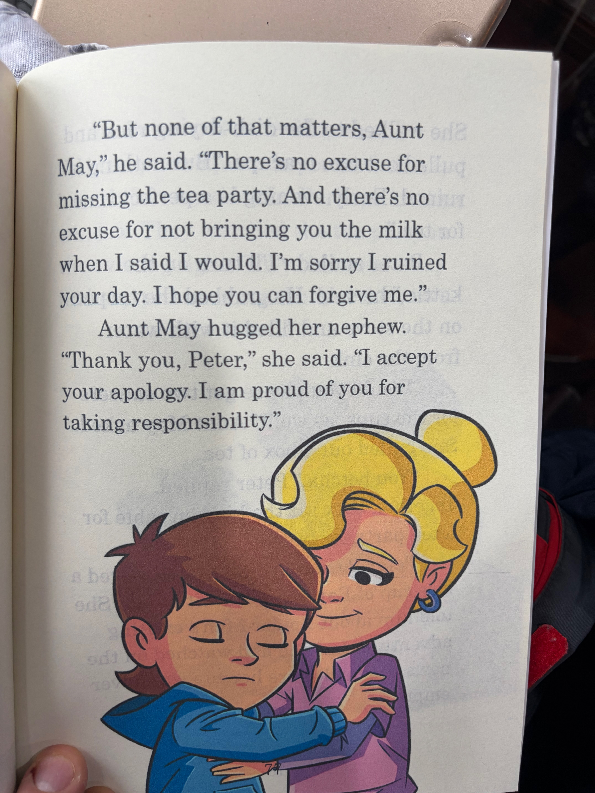

# Chapter 12

<table>
<tr>
<td width="52%" valign="top">

</td>
<td width="48%" valign="top">

## 中文演绎
第 12 章

彼得·帕克站在自家前门前，盯着门看。一只手里攥着家门钥匙，另一只手里拿着一盒牛奶。他深吸一口气，打开门，走了进去。

"梅姨，"他喊道，"我回来了。"

没有人回答。屋里的灯都关了，只有厨房还亮着。他听见有水声，于是循着声音走去。

梅姨正在水槽边洗最后一个茶杯。她把它放到旁边沥干，又关掉了水龙头。

## 英文原文朗读
Chapter 12

Peter Parker stared at his front door. In one hand he held his house keys. In the other, he held a carton of milk. He took a deep breath, unlocked the door, and went inside.

"Aunt May," he called. "I'm back."

There was no response. All the lights in the house were out except for those in the kitchen. He could hear water running. He followed the sound.

Aunt May was cleaning the last of the teacups in the sink. She set it to dry alongside the others. She turned off the water.

</td>
</tr>
</table>

<table>
<tr>
<td width="52%" valign="top">

</td>
<td width="48%" valign="top">

## 中文演绎
"我把牛奶买回来了，"彼得说。他没有看梅姨，而是低头盯着自己的脚。

"谢谢你，彼得，"梅姨说，"我们明天早饭可以用。"

彼得抬起头。"明天？"他问，"可是茶会……？"

"已经结束了，"她说，"安娜和她的外甥女早就走了。"

彼得的脸一下涨得通红。要是他能把自己是蜘蛛侠这件事告诉梅姨就好了。那样她就会明白他为什么会迟到

## 英文原文朗读
"I brought the milk," Peter said. He did not look at Aunt May. Instead, he looked at his feet.

"Thank you, Peter," Aunt May said. "We can use it for breakfast tomorrow."

Peter looked up. "Tomorrow?" he asked. "But the tea party, ?"

"Is over," she said. "Anna and her niece left early."

Peter's face flushed red. If only he could tell Aunt May he was Spider-Man. She would understand why he was late

</td>
</tr>
</table>

<table>
<tr>
<td width="52%" valign="top">

</td>
<td width="48%" valign="top">

## 中文演绎
带着牛奶回来，他也就不用这么内疚了。接着彼得忽然冒出一个念头。虽然他不能告诉梅姨自己是超级英雄，但他至少可以告诉她，自己迟到并不是他的错！

"你知道吗，"彼得说，"其实我本来会立刻带着牛奶回来的，可我碰见了一个需要我帮忙的朋友。我没法拒绝，因为她真的陷在一个满是沙子的，我是说，一个很棘手的麻烦里。可就在我以为事情已经解决的时候，情况却变得更大条了！我怎么会知道事情会变成那样呢？"

彼得说到这里停住了。他自己的这些话，让他想起了先前听到过的话。听起来就像沙人为自己糟糕行为找借口时说的那些话。彼得走到梅姨面前，握住了她的手。

## 英文原文朗读
with the milk and he wouldn't have to feel so guilty. Then Peter had an idea. While he couldn't tell Aunt May that he was a Super Hero, he could tell her that being late wasn't his fault!

"You know," Peter said, "I would have been back with the milk right away but I ran into a friend who needed my help. I couldn't say no because she was really in a sandy, I mean, sticky situation. And just when I thought the problem was solved, it got even bigger! How was I supposed to know that was going to happen?"

Peter stopped talking. His words reminded him of ones he had heard earlier. They sounded like the words the Sandman had used to excuse his bad behavior. Peter went to Aunt May and took her hands.

</td>
</tr>
</table>

<table>
<tr>
<td width="52%" valign="top">

</td>
<td width="48%" valign="top">

## 中文演绎
"但那些都不重要，梅姨，"他说，"错过茶会没有任何借口。答应了把牛奶带回来却没做到，也没有任何借口。对不起，是我把你这一天搞砸了。希望你能原谅我。"

梅姨抱住了她的外甥。

"谢谢你，彼得，"她说，"我接受你的道歉。我为你愿意承担责任而感到骄傲。"

## 英文原文朗读
"But none of that matters, Aunt May," he said. "There's no excuse for missing the tea party. And there's no excuse for not bringing you the milk when I said I would. I'm sorry I ruined your day. I hope you can forgive me."

Aunt May hugged her nephew.

"Thank you, Peter," she said. "I accept your apology. I am proud of you for taking responsibility."

</td>
</tr>
</table>

[⬅ 返回章节目录](../README.md)
