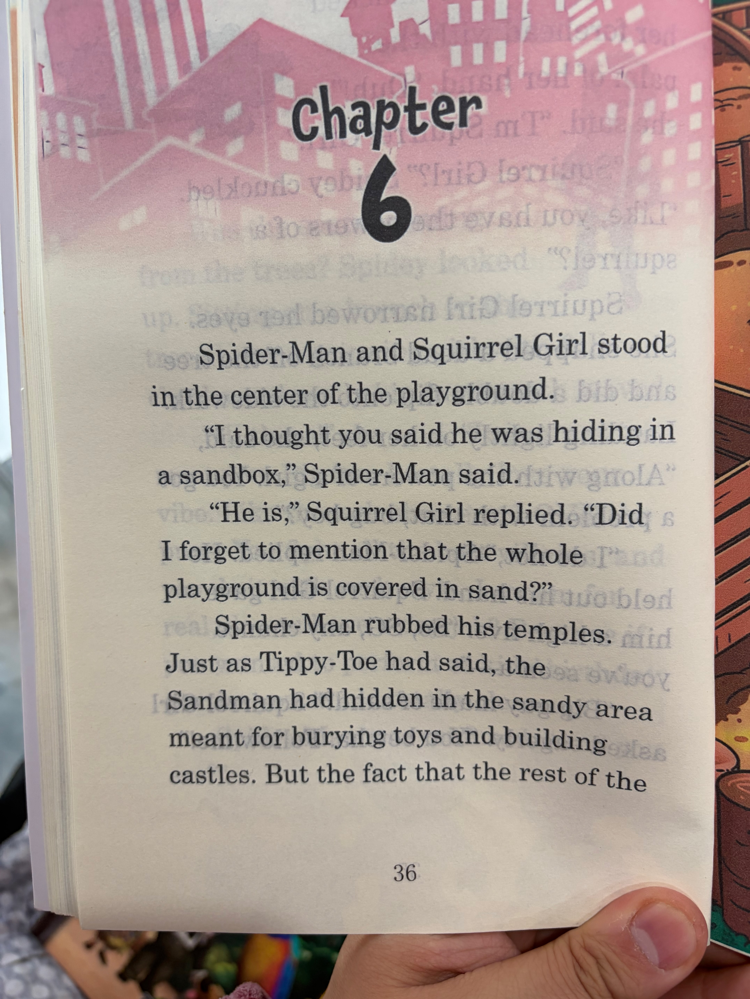

# Chapter 31

<table>
<tr>
<td width="52%" valign="top">

</td>
<td width="48%" valign="top">

## 中文演绎
第 6 章

蜘蛛侠和松鼠妹站在游乐场中央。

"你不是说他躲在沙坑里吗？"蜘蛛侠问。

"是啊，"松鼠妹回答，"我是不是忘了说，整个游乐场地面上全是沙子？"

蜘蛛侠揉了揉太阳穴。正如蒂比趾说的那样，沙人的确藏在那片本来用来埋玩具、堆沙堡的沙地里。可问题在于，游乐场其余的

## 英文原文朗读
Chapter 6

Spider-Man and Squirrel Girl stood in the center of the playground.

"I thought you said he was hiding in a sandbox," Spider-Man said.

"He is," Squirrel Girl replied. "Did I forget to mention that the whole playground is covered in sand?"

Spider-Man rubbed his temples. Just as Tippy-Toe had said, the Sandman had hidden in the sandy area meant for burying toys and building castles. But the fact that the rest of the

</td>
</tr>
</table>

[⬅ 返回目录](../README.md)
