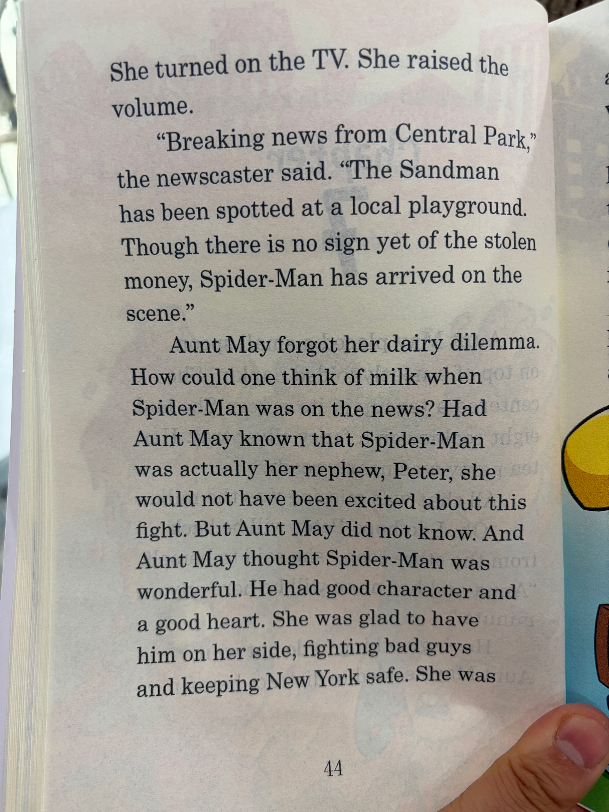

# Chapter 37

<table>
<tr>
<td width="52%" valign="top">

</td>
<td width="48%" valign="top">

## 中文演绎
她打开电视，把音量调大。

"来自中央公园的突发新闻，"播报员说道，"沙人在一处当地游乐场被发现了。目前仍没有失窃钱款的下落，但蜘蛛侠已经赶到现场。"

梅姨一下把牛奶的烦恼抛到了脑后。电视上都播到蜘蛛侠了，谁还顾得上牛奶？如果梅姨知道蜘蛛侠其实就是她的外甥彼得，她可就一点也不会为这场战斗感到兴奋了。但梅姨并不知道。而且在梅姨眼里，蜘蛛侠非常了不起。他人品好，心地也好。她很庆幸有他站在自己这边，打击坏蛋，守护纽约安全。她也

## 英文原文朗读
She turned on the TV. She raised the volume.

"Breaking news from Central Park," the newscaster said. "The Sandman has been spotted at a local playground. Though there is no sign yet of the stolen money, Spider-Man has arrived on the scene."

Aunt May forgot her dairy dilemma. How could one think of milk when Spider-Man was on the news? Had Aunt May known that Spider-Man was actually her nephew, Peter, she would not have been excited about this fight. But Aunt May did not know. And Aunt May thought Spider-Man was wonderful. He had good character and a good heart. She was glad to have him on her side, fighting bad guys and keeping New York safe. She was

</td>
</tr>
</table>

[⬅ 返回目录](../README.md)
