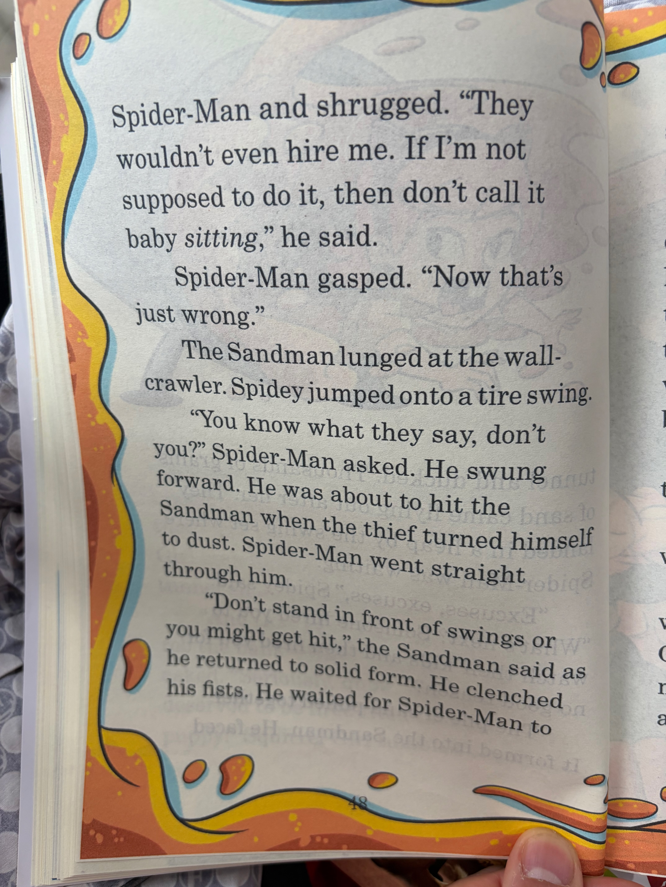

# Chapter 41

<table>
<tr>
<td width="52%" valign="top">

</td>
<td width="48%" valign="top">

## 英文原文朗读
Spider-Man and shrugged. "They wouldn't even hire me. If I'm not supposed to do it, then don't call it baby sitting," he said.

Spider-Man gasped. "Now that's just wrong."

The Sandman lunged at the wall-crawler. Spidey jumped onto a tire swing.

"You know what they say, don't you?" Spider-Man asked. He swung forward. He was about to hit the Sandman when the thief turned himself to dust. Spider-Man went straight through him.

"Don't stand in front of swings or you might get hit," the Sandman said as he returned to solid form. He clenched his fists. He waited for Spider-Man to

## 中文演绎
蜘蛛侠，他耸了耸肩。"他们甚至都不会雇我。要是不想让我做，那就别把它叫作 babysitting，"他说。

蜘蛛侠倒吸一口气。"这也太离谱了。"

沙人朝这位爬墙英雄猛扑过去。小蜘蛛跳上了一个轮胎秋千。

"你知道人们怎么说的吧？"蜘蛛侠问道。他向前荡去，眼看就要撞上沙人，可那小偷突然把自己变成了沙尘。蜘蛛侠一下从他身体里穿了过去。

"别站在秋千前面，不然会被撞到，"沙人重新凝成实体时说道。他攥紧拳头，等着蜘蛛侠

</td>
</tr>
</table>

[⬅ 返回目录](../README.md)
